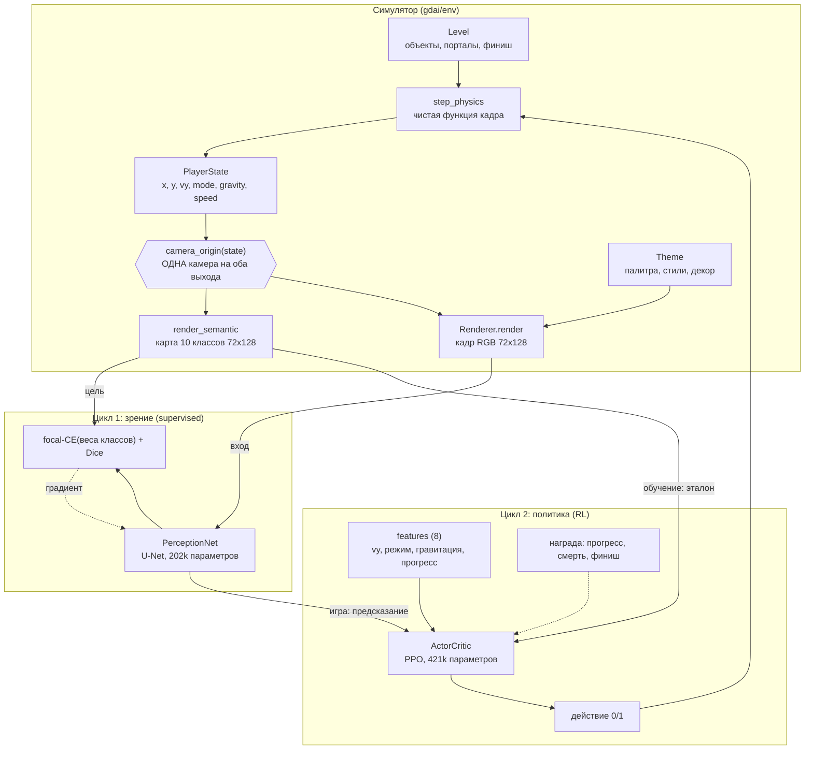

# Архитектура GDAI

Углублённый разбор того, что и почему устроено именно так. Обзор и команды — в
[README.md](../README.md); формальный контракт имён, сигнатур и констант — в
[SPEC.md](SPEC.md). Здесь — инженерные решения и их обоснование.

---

## Содержание

1. [Общая схема данных](#1-общая-схема-данных)
2. [Физика и её константы](#2-физика-и-её-константы)
3. [Формат уровня](#3-формат-уровня)
4. [Генератор и доказательство проходимости](#4-генератор-и-доказательство-проходимости)
5. [Каноническая карта и камера](#5-каноническая-карта-и-камера)
6. [Доменная рандомизация](#6-доменная-рандомизация)
7. [U-Net зрения](#7-u-net-зрения)
8. [Среда и practice-чекпойнты](#8-среда-и-practice-чекпойнты)
9. [PPO и учебный план](#9-ppo-и-учебный-план)
10. [Как измеряется обобщение](#10-как-измеряется-обобщение)
11. [Известные ограничения](#11-известные-ограничения)
12. [Идеи развития](#12-идеи-развития)

---

## 1. Общая схема данных

Ключевая идея: у проекта два независимых обучающих цикла, соединённых одним
общим представлением — канонической семантической картой.



Два цикла обучаются порознь и в любом порядке. Соединяются они только в
`gdai/pipeline.py::GDAgent`, где «глаза» отдают карту «мозгу».

Почему разрез именно здесь: слева от карты данные **бесконечны и размечены**
(симулятор знает истину), справа — **дороги и размечены только наградой**.
Каждой половине достаётся тот метод обучения, который для неё эффективен.

---

## 2. Физика и её константы

`gdai/env/physics.py`. Функция ровно одна:

```python
def step_physics(state: PlayerState, level: Level, hold: bool,
                 dt: float = DT) -> tuple[PlayerState, dict]
```

Она **чистая** — не мутирует вход, не имеет глобального состояния, не использует
случайность и не импортирует pygame. Это не эстетика: без чистоты невозможен ни
поиск проходимости (он откатывает состояния тысячами), ни воспроизводимость
эпизода по seed.

### Константы (`gdai/constants.py`)

| Величина | Значение | Откуда |
|---|---|---|
| `DT` | 1/60 с | кадр игры |
| `GRAVITY` | 76.8 тайл/с² | подобрана так, чтобы прыжок дал 2.4 тайла |
| `JUMP_V` | 19.2 тайл/с | высота `v²/2g = 2.4`, полёт `2v/g = 0.5 с` |
| `MAX_FALL_V` | 30.0 тайл/с | терминальная скорость |
| `SPEED_TILES_PER_SEC` | 8.36, 10.386, 12.914, 15.6, 19.2 | пять скоростей GD (0.5×…4×) |
| `SHIP_THRUST` / `SHIP_GRAVITY` / `SHIP_MAX_V` | 52 / 52 / 16 | симметричная тяга корабля |
| `WAVE_SPEED_RATIO` | 1.0 | волна идёт строго под 45° |
| `PAD_*_V` | 24 / 15 / 30 | жёлтый / розовый / красный трамплин |
| `ORB_*_V` | 19.2 / 13 / 26 | жёлтое / розовое / красное кольцо |

Хитбоксы (полуразмеры от центра):

| Объект | hx | hy | Комментарий |
|---|---|---|---|
| игрок (куб, корабль) | 0.45 | 0.45 | коробка 0.9×0.9 |
| игрок (волна) | 0.25 | 0.25 | иначе узкие коридоры непроходимы физически |
| шип | 0.28 | 0.28 | **сильно меньше спрайта** — как в оригинале |
| пила | 0.40 | 0.40 | крупнее шипа, но всё ещё «прощающая» |
| блок | 0.5 | 0.5 | |
| платформа | 0.5 | 0.25 | тонкая, но пролезть под ней нельзя |
| пад | 0.5 | 0.25 | |
| кольцо | 0.60 | 0.60 | ловит щедро: реакция важнее пикселей |
| портал | 0.35 | 1.25 | высокий овал |
| финиш | 0.5 | 6.0 | вертикальная полоса во весь экран |

### Порядок операций внутри кадра

Порядок воспроизводит поведение Geometry Dash, и менять его нельзя:

```
1. горизонталь: x += SPEED[speed_index] * dt
   боковой удар о SOLID -> смерть (кроме микро-зацепа сверху, см. ниже)
2. порталы (по пересечению), пады (срабатывают САМИ),
   кольца (только по ФРОНТУ нажатия: hold and not hold_prev), финиш
3. вертикальная скорость по режиму
4. y += dy, разбор столкновений с SOLID
5. пол GROUND_Y и потолок ceiling_y
6. HAZARD -> смерть;  x >= level.length -> финиш
```

### Три решения, без которых физика была бы неправильной

**Гравитационная система координат.** Порталы переворачивают гравитацию, и
писать каждую проверку дважды («если вниз… если вверх…») — прямой путь к ошибкам.
Поэтому вертикаль считается в координатах `Y = y * gravity`, `VY = vy * gravity`.
В них гравитация ВСЕГДА тянет к меньшему `Y`, «пол» всегда снизу, а обратное
преобразование — то же умножение на ±1. Один и тот же код работает и на полу, и
на потолке.

**Интегрирование трапецией.** Вертикальное смещение считается как
`dy = (vy_до + vy_после)/2 · dt`, а не `dy = vy · dt`. Для постоянного ускорения
трапеция совпадает с аналитическим решением; наивная схема завысила бы прыжок до
2.56 тайла вместо канонических 2.4 — то есть сдвинула бы всю геометрию уровней на
7%. Тест `test_jump_height_is_2_4_tiles` следит за этим.

**Опора подтверждается каждый кадр.** `on_ground` сбрасывается в `False` перед
разбором столкновений и выставляется заново только по факту контакта. Без этого
игрок, сошедший с края блока, навсегда оставался бы «на земле»: он мог бы прыгать
в воздухе, признак врал бы политике, а поиск проходимости считал бы проходимыми
уровни, которые пройти нельзя.

Два допуска в коде существуют ради float-арифметики, а не ради поблажек:
`CONTACT_EPS = 1e-9` (после «прилипания» к блоку координаты вида `1.45 - 0.45`
дают ошибку 1e-16, и без допуска игрок умирал бы от собственного пола) и
`STEP_UP_TOLERANCE = 0.02` (зацеп сверху на доли миллитайла — это неточность, а не
удар в стену; куб ставится на блок).

### Режимы

* **Куб.** С земли при удержании — мгновенный `VY = JUMP_V`. Прыгает **снова
  сразу после приземления**, если кнопка не отпущена, — как в оригинале.
* **Корабль.** `VY += (±SHIP_THRUST) · dt`, клип по `SHIP_MAX_V`. Любое касание
  блока — смерть. Пол и потолок мира — не смерть, а упор.
* **Волна.** `VY = ±speed` мгновенно, без инерции. Касание блока, пола или
  потолка — смерть. Стартует на высоте `WAVE_START_HEIGHT = 2.0`, потому что
  вплотную к смертельному полу эпизод кончался бы на первом кадре.

Пады и кольца различаются принципиально: **пад срабатывает сам** (условие
`vy·gravity <= 0` заменяет флаг «уже использован» — после срабатывания игрок
летит вверх и повторно не подбрасывается), **кольцо — только по фронту нажатия**.
Ради второго в `PlayerState` есть поле `hold_prev`: без памяти о прошлом кадре
зажатая кнопка использовала бы одно кольцо шестьдесят раз в секунду. На одном
кадре кольцо перебивает пад — игрок нажал осознанно.

---

## 3. Формат уровня

`gdai/env/level.py`. Уровень — единственный «источник правды», из которого
одновременно строятся физика, каноническая карта и красивый кадр. Поэтому объект
хранит **только смысл**: тип и координаты центра. Ни цвета, ни поворота, ни
размера — всё оформление живёт в `themes`/`render` и на игру не влияет.

Система координат: тайлы, `x` вправо, `y` **вверх**, пол на `y = 0`, координаты —
центр объекта. Один тайл = один блок Geometry Dash (30 px в оригинале).

```json
{
  "version": 1,
  "name": "grand_tour",
  "length": 193.0,
  "start_mode": "cube",
  "start_speed_index": 1,
  "start_gravity": 1,
  "ceiling_y": 12.0,
  "theme_hint": "lava",
  "checkpoints": [25.0, 51.5, 76.0],
  "objects": [{"type": "spike", "x": 14.0, "y": 0.5}]
}
```

24 типа объектов раскладываются в 10 семантических классов; таблица
`_TYPE_TO_CLASS` — единственное место, где живёт это соответствие, и физика с
растеризатором обязаны спрашивать именно там.

**Бакет-индекс.** Физика на каждом кадре спрашивает «что рядом со мной», и
линейный перебор тысяч объектов сделал бы шаг в сотни раз дороже самой физики.
`Level` строит словарь `int(x) -> [объекты]` и отвечает на `objects_in_range` за
O(k), беря соседние бакеты с запасом `_BUCKET_MARGIN = 2` (центр широкого объекта
может лежать за границей полосы). Индекс поддерживается инкрементально в `add()`
и пересобирается `rebuild_index()` после прямого изменения списка.

Сохранение атомарное (`tmp` + `os.replace`), числа округляются до 4 знаков —
файлы уровней должны быть человекочитаемыми, а не полными `0.30000000000000004`.

---

## 4. Генератор и доказательство проходимости

Это самая нетривиальная часть симулятора. Процедурный генератор без проверки —
это генератор красивых непроходимых уровней, а агент, обучающийся на них,
получает шум вместо сигнала: он умирает не потому, что ошибся, а потому что
пройти было нельзя.

### 4.1 Паттерны-участки

`gdai/env/generator.py`. Уровень собирается не «россыпью объектов по шуму», а
**участками**. Их 15:

| Паттерн | Мин. сложность | Чему учит |
|---|---|---|
| `rest` | 0.00 | ритм; гарантированно проходимый запасной вариант |
| `single_spike` | 0.00 | базовое «прыгни здесь» |
| `block_stairs` | 0.00 | лестница вверх со спуском обрывом |
| `spike_row` | 0.08 | один прыжок, но дольше в воздухе |
| `corridor` | 0.08 | низкий потолок: **наказание за лишнее нажатие** |
| `saw` | 0.10 | пилы на полу и висящие преграды |
| `spike_stagger` | 0.15 | серия прыжков с приземлением между ними |
| `pad_jump` | 0.15 | трамплин: нельзя прыгать ПЕРЕД падом |
| `platform_gap` | 0.20 | остров среди шипов — перелёт в два прыжка |
| `speed_change` | 0.20 | портал скорости |
| `jagged_floor` | 0.25 | зубчатый пол с шипами в ямах |
| `ship_section` | 0.25 | корабль: коридор из колонн с окнами |
| `orb_chain` | 0.30 | цепочка колец над широким полем шипов |
| `gravity_flip` | 0.30 | переворот гравитации |
| `wave_section` | 0.45 | волна: узкий коридор под 45° |

Паттерны пишутся в **локальной системе**, где `y = 0` — «пол под ногами», а рост
`y` — «вверх для игрока». При обычной гравитации это мировые координаты, при
перевёрнутой — зеркало относительно потолка (`y_world = ceiling_y - y`), и шипы
меняют ориентацию. Один код работает и на полу, и на потолке.

Геометрия считается по настоящим формулам прыжка, а не подбирается:

```python
_jump_span(ctx)      # 2·JUMP_V/GRAVITY · speed — длина полного прыжка в тайлах
_airtime_above(y)    # сколько секунд центр игрока выше порога y
_rise_span(ctx, y)   # сколько тайлов проезжает игрок, ПОДНИМАЯСЬ до высоты y
_slack(ctx, d)       # запас: (15 − 9·d) кадров на выбор момента прыжка
_lead_in(ctx, d)     # разбег = полигрока + полупрепятствия + подъём + запас
```

`_slack` — главная ручка сложности. Физически препятствие проходимо, если
существует **хотя бы один** правильный кадр. Уровень, где такой кадр ровно один,
честен, но невыносим — поэтому окно сжимается плавно, от 15 кадров (четверть
секунды) при `difficulty = 0` до 6 кадров при `difficulty = 1`.

Порталы ставятся **стопкой из двух штук** высотой 2.5 тайла. Портал ловит игрока
полосой ±1.25 тайла: куб на вершине прыжка в одиночный портал ещё попадает, а
вылетевший с пада — уже нет. Пропущенный портал раздваивает состояние мира (часть
веток с новой скоростью, часть со старой), что и путает поиск, и делает уровень
нечестным.

### 4.2 Поиск по кадрам

`gdai/env/solver.py`. «Проходимость» здесь не эвристика, а факт: если существует
последовательность действий из `{0, 1}`, приводящая игрока к финишу, поиск её
найдёт — в пределах выделенного бюджета.

Наивный перебор двух действий на кадр даёт 2^N веток. Спасают три вещи:

**Синхронность по кадрам.** Ищем волной: множество достижимых состояний после
кадра *t* порождает множество после *t+1*. Это BFS без очереди — фронт хранится
списком.

**Дедупликация округлённых состояний.** Ключ:

```python
(int(x/0.25), int(y/0.25), int(vy/0.5), on_ground, mode, gravity, speed_index, hold_prev)
```

Физически неразличимые состояния склеиваются, и фронт держится десятками
состояний, а не растёт экспоненциально: на земле все ветки схлопываются в одну, в
воздухе их столько, сколько было моментов начала прыжка. Склейка идёт **только
внутри одного кадра** — общая таблица посещённых была бы ошибкой: за кадр игрок
проезжает 0.14–0.32 тайла при кванте 0.25, так что бегущий по земле игрок
регулярно попадает в тот же ключ, что и кадром раньше, и «уже видели» вырезало бы
единственную живую траекторию.

`hold_prev` входит в ключ только рядом с кольцами (`orb_zone`) и порталами режима:
он нужен там, где нажатие меняет физику, а стоит ровно вдвое больше состояний.

**Прореживание фронта.** Если состояний всё-таки слишком много (у корабля `vy`
непрерывна), фронт режется равномерным шагом, а не «первыми N»: состояния лежат в
порядке порождения, соседние почти одинаковы, и первые N оставили бы один узкий
пучок траекторий.

Плюс оптимизация `_useful_holds`: куб в воздухе не управляем вообще, обе ветки
дают физически одно и то же состояние. Вне окрестностей колец и порталов режима
проверяется только одна.

**Направление ошибки выбрано осознанно.** Округление и прореживание могут
«потерять» решение (ложное «непроходим»), но НИКОГДА не выдумать его — каждое
состояние получено настоящим `step_physics`. Генератору это подходит: ложный
отказ стоит перегенерации участка, ложное «да» стоило бы непроходимого уровня.

### 4.3 Сборка с инкрементальной проверкой

```
frontier = [начальное состояние]
x = START_RUNWAY (4 тайла разгона)
пока x < конец тела уровня:
    выбрать паттерн (по сложности, бюджету длины, кулдауну спец-секций)
    до 3 попыток:
        добавить объекты участка
        search_forward(level, frontier, x_end)     # довести фронт до конца участка
        если фронт дошёл: принять участок, frontier = новый фронт, break
        иначе: откатить объекты, попробовать другие случайные параметры
    если ни одна попытка не прошла: поставить `rest` (проходим всегда)
вернуть гравитацию к обычной, поставить goal, проверить хвост
финальная проверка: is_solvable(level) целиком
```

Проверка **инкрементальная**: поиск продолжается с сохранённого фронта, поэтому
построение линейно по длине уровня, а не квадратично. Бюджеты подобраны под то,
что генерация запускается тысячами раз (учебный план RL): фронт при сборке 64
состояния, 60 000 узлов на участок, 400 000 на финальную проверку.

Если случайность трижды подряд дала тупик, `generate_level` возвращает аварийный
ровный уровень с редкими шипами. Он проходим по построению — но функция никогда
не возвращает непроходимый уровень.

Измерено: генерация уровня со сложностью 0.1–0.9 — **0.3–0.5 с**, финальная
проверка `is_solvable` — **0.06 с**. Тест `test_twenty_levels_are_solvable`
проверяет 20 уровней разной сложности.

### 4.4 Чекпойнты

`make_checkpoints(level, every=25.0)` — не арифметическая прогрессия. Чекпойнт
посреди поля шипов, внутри блока или в двух тайлах перед стеной бесполезен: с
него нельзя стартовать. Поэтому кандидат сдвигается к ближайшему «чистому» месту
(`_is_clear`: нет опасностей в 3 тайлах, блоков в 2, порталов в 3 — расстояние
считается до **края** объекта, не до центра), а потом **проверяется поиском**
(`_is_viable`): из этой точки игрок обязан прожить ближайшие 18 тайлов и
доиграть уровень **до финиша**. Геометрической проверки мало — участок может
требовать разбега длиннее, чем расстояние до первой стены.

Чекпойнт, с которого уровень доиграть нельзя, вреднее отсутствия чекпойнта: агент
бесконечно тренируется на заведомо непроходимом куске и никогда не получает
награду за прохождение.

---

## 5. Каноническая карта и камера

`gdai/env/semantic.py` — здесь рождается общий язык двух половин проекта.

### Камера

```python
def camera_origin(state: PlayerState) -> tuple[float, float]
```

Чистая, детерминированная функция **только от состояния игрока**. Это критично:
рендерер декораций обязан звать её же, иначе пиксель кадра перестанет
соответствовать пикселю разметки и обучение зрения превратится в обучение на
шуме.

* по X: `cam_x = x - PLAYER_X_IN_VIEW` — игрок всегда на 4-м тайле слева, впереди
  видно 12 тайлов будущего;
* по Y: камера хочет держать игрока на 0.6 высоты кадра, но не имеет права
  опуститься ниже `GROUND_Y - 1.0`. Пока игрок скачет у земли — камера прижата к
  полу и не двигается вовсе (обычный прыжок в 2.4 тайла не достаёт до порога),
  поэтому **пол работает неподвижным ориентиром**. Выше ~4 тайлов (корабль,
  волна) камера плавно уезжает за игроком.

Стык двух режимов размазан по полосе `CAM_SOFT_K = 0.5` через `_smooth_max`.
Жёсткий `max` дал бы разрыв производной: камера, доехав до ограничителя, щёлкала
бы между режимами, и разметка дёргалась бы на пиксель туда-обратно при почти
неподвижном игроке.

### Растеризация

Карта строится на каждом кадре в каждой из восьми сред и на каждом сэмпле
датасета зрения, поэтому здесь нет pygame и нет попиксельных циклов: всё сводится
к горизонтальным отрезкам (span-ам), которые numpy заполняет одним присваиванием
среза, а запись идёт прямо в память через `memoryview`. Измерено: **≈45 000 карт
в секунду** на одном ядре.

Пиксель считается закрашенным, если его **центр** попал внутрь фигуры — это даёт
симметричную растеризацию без «расползания» объектов на полпикселя.

Формы: шип — треугольник с учётом ориентации (четыре варианта), пила — круг,
кольцо — **кольцо с дыркой** (`RING_INNER_RATIO = 0.5`; кольцо обязано читаться
именно как кольцо — это единственный объект, требующий нажатия, и путать его с
пилой политике нельзя), портал — вертикальный овал, блок и пад — прямоугольники.

Приоритет отрисовки (SPEC §7), таблица **биективна**, чтобы тот же порядок годился
для приоритетного сжатия:

```
EMPTY 0 < SOLID 1 < PORTAL_SPEED 2 < PORTAL_MODE 3 < PORTAL_GRAVITY 4
        < PAD 5 < ORB 6 < GOAL 7 < HAZARD 8 < PLAYER 9
```

Пол (всё ниже `GROUND_Y`) и потолок (всё выше `ceiling_y`) заливаются `SOLID` до
края кадра: для политики это такие же твёрдые поверхности, как блоки.

Карта показывает **хитбоксы**, а не спрайты. В Geometry Dash шип нарисован
заметно больше своей смертельной зоны; агент должен видеть то, что его убивает.

### Сжатие для политики

`downsample_semantic(sem, 2)` отдаёт блок 2×2 самому **приоритетному** классу, а
не самому частому. Шип занимает несколько пикселей; усреднение или мода стёрли бы
его, и агент узнал бы о шипе, только влетев в него.

---

## 6. Доменная рандомизация

`gdai/env/themes.py` + `gdai/env/render.py`. Это сердце устойчивости к дизайну.

### Инвариант

**Ни одно поле `Theme` не влияет на геометрию.** Тема может перекрасить шип в
цвет блока, утопить передний план в фоне и перевернуть всю палитру — карта не
изменится ни на байт. Как только тема получит право сдвинуть объект, кадр и
разметка разъедутся, и обучение зрения станет обучением на шуме.

Отсюда же `Theme.shake = 0` по умолчанию: сдвинуть кадр, не сдвинув разметку,
значит систематически врать. Фактический сдвиг доступен в `Renderer.last_shake`,
чтобы вызывающий мог применить тот же сдвиг к карте.

### Оси вариативности

```
ПАЛИТРА          14 встроенных тем + непрерывное пространство random_theme()
                 гармонические схемы оттенков: mono, analog, complement, triad, chaos

ФОН              plain | grid | stars | stripes | circles | clouds | noise
                 масштаб узора 0.25..4, 0..3 слоя параллакса
                 фигуры параллакса: blocks | triangles | circles | bars | mountains

ОБЪЕКТЫ          блок:  flat | outline | bevel | striped | dotted | gradient | noise
                 шип:   solid | outline | gradient | double
                 пол:   flat | grid | stripes | gradient | dotted
                 обводка 0..3 px, скругление 0..6 px

ДЕКОР (неигровой) bars | pipes | gears | glyphs | floaters | mixed |
                  lattice | waves | crystals
                  12 видов фигур, плотность и контраст — независимые ручки

ЭФФЕКТЫ          glow, bloom, виньетка, шум, контраст 0.3..2.5, гамма 0.4..2.5,
                 хроматическая аберрация, партиклы, след за игроком,
                 «биение» яркости с периодом 48 кадров (~0.8 с)

КАНАЛ (augment)  яркость/контраст, гамма, цветовой джиттер, обесцвечивание,
                 сдвиг каналов на доли пикселя, гауссов шум, соль-перец,
                 размытие, JPEG-подобные артефакты, постеризация, cutout
```

### «Злые» темы

`random_theme(rng)` намеренно сэмплит вредные случаи. Полностью независимый
рандом по каждому полю порождал бы в основном мутно-серые кадры, где всё плохо
видно, и сеть училась бы на бесполезном шуме. Здесь палитра строится осмысленно
(фон / передний план / акценты), а сверху накидываются модификаторы, каждый из
которых убивает один «лёгкий» признак:

| Модификатор | Вероятность | Какой признак убивает |
|---|---|---|
| `similar_hazard` | ~35% | шип красится почти как блок — цвет перестаёт разделять `SOLID` и `HAZARD`, остаётся только треугольная форма |
| `low_contrast` | ~28% | передний план подтягивается к фону — пропадает «граница по яркости» |
| `monochrome` | ~14% | палитра обесцвечена целиком — цветовой канал не несёт информации |
| `inverted` | ~14% | палитра инвертирована — «тёмный фон, светлые блоки» перестаёт быть правилом |

Палитра декора тоже сэмплится тремя стратегиями: «туман» (еле различим на фоне,
~45%), «конструкции» (заметные, своего цвета, ~33%) и самый вредный вариант —
декор, покрашенный **как игровой блок** (~22%). Раньше декор всегда уводился к
цвету фона, и «декорация = бледное пятно» становилось надёжным признаком — ровно
тем, на который сеть не должна опираться.

### Слой декора

Главный источник сложности задачи сегментации. Декорации — полосы, трубы,
шестерёнки, глифы, кристаллы, волны, **плавающие блоки без хитбокса** — выглядят
как часть уровня, но их нет ни в физике, ни в карте.

Декор детерминирован по мировым координатам: мир нарезан на ячейки по 6 тайлов,
в каждой генерируется до 11 кандидатов с «рангом», и рисуются те, чей ранг ниже
порога `decoration_level · (0.45 + 0.55 · theme.decor_density)`. Поэтому объект,
однажды появившийся на `x = 42`, будет там всегда, а не «поплывёт» вслед за
камерой. Раскладка переживает смену темы — меняется только цвет.

Непрозрачность декора ограничена сверху (`_DECOR_ALPHA_CAP = 205`): полностью
непрозрачная декорация — это уже не декорация, шестерёнка нужного размера стала
бы неотличима от игрового кольца, и задача сегментации перестала бы иметь
решение. Остаточная прозрачность — тот самый признак «это мусор», который сеть
обязана выучить.

### Производительность

Всё, что зависит только от темы (фон, параллакс, спрайты, LUT гаммы/контраста,
маска виньетки), считается один раз в `set_theme`; декорации кэшируются по
ячейкам мира; пост-эффекты — чистый numpy на массиве 72×128×3 без питоновских
циклов. Измерено: **≈650 кадров/с** на одном ядре.

### Проверка инварианта

`tests/test_render_invariance.py` и шаг 4 команды `selfcheck`. Тест берёт все 14
встроенных тем и 30 случайных и требует одновременно:

* семантическая карта одного и того же состояния совпадает **байт в байт** (и
  `camera_origin` возвращает то же самое) для каждой темы;
* средняя и медианная попиксельная разница между кадрами больше **20 из 255**;
* различны не менее 90% пар кадров, и нет ни одной пары с нулевой разницей;
* `shake == 0` у всех встроенных и всех случайных тем;
* существует хотя бы одна тема, где шип и блок близки по цвету.

На реальном прогоне `selfcheck` кадры пяти тем разошлись на 65–149 из 255 при
идентичной карте.

---

## 7. U-Net зрения

`gdai/perception/model.py`. Сеть решает узкую задачу: кадр 3×72×128 → логиты
10×72×128. Ей не нужно узнавать тысячу объектов — нужно надёжно отделить **форму**
игрового объекта от бесконечно разнообразной декорации.

```
72x128  stem 3->16 ─────────────────────────────── skip ───────────────┐
36x64   down 16->24, conv 24 ───────────── skip ──────────────┐        │
18x32   down 24->48, conv 48 ──────── skip ────────┐          │        │
9x16    down 48->72, conv 72, conv 72 (bottleneck) │          │        │
18x32   up + concat(72,48) -> 1x1 -> 48, conv 48 ──┘          │        │
36x64   up + concat(48,24) -> 1x1 -> 24, conv 24 ─────────────┘        │
72x128  up + concat(24,16) -> 1x1 -> 16, conv 16 ──────────────────────┘
72x128  head 1x1  16 -> 10 логитов
```

**202 218 параметров** при `base_channels = 24, depth = 3` (лимит SPEC — 500k),
рецептивное поле 77 пикселей.

Четыре решения, которые здесь важнее «глубины» и «модности»:

**Маленькая.** Большая сеть на синтетике быстро начинает запоминать частные
признаки конкретных тем; узкая вынуждена опираться на устойчивое — контур,
симметрию, положение. Плюс она обязана работать в реальном времени рядом с
политикой на одном CPU.

**GroupNorm, а не BatchNorm.** В бою кадры приходят по одному (`predict`), и
статистика батча вырождается: BatchNorm считает mean/var по единственному кадру и
«плывёт» при смене темы — ровно там, где нужна стабильность. GroupNorm нормирует
внутри кадра, поэтому результат для батча 1 и для батча 16 идентичен (тест
`test_batch_size_does_not_change_output`).

**Основная работа на пониженном разрешении.** Свёртка на полном кадре стоит вчетверо
дороже, чем на половинном, а форма шипа читается и там. Полноразмерными остаются
только тонкий stem (16 каналов, а не 24) и последний блок декодера.

**1×1 сразу после конкатенации.** Он сжимает объединённый тензор до рабочей
ширины ДО дорогой свёртки 3×3, и самый большой блок декодера обходится втрое
дешевле. Апсемплинг — `nearest` по размеру skip-тензора, а не множителем 2: так
сеть корректно работает и на кадрах, чьи стороны не делятся на 2^depth (например,
при захвате настоящей игры).

### Лосс: почему не просто CrossEntropy

Задача выглядит как обычная сегментация, но у неё перекос на **три порядка**.
Замеренные доли пикселей в датасете:

```
EMPTY 87.7%   SOLID 10.4%   GOAL 0.96%   PLAYER 0.57%
PORTAL_MODE 0.16%   HAZARD 0.12%   остальные — сотые доли процента
```

Сеть, предсказывающая «везде пусто, снизу пол», получает `pixel_acc ≈ 0.95` и
убивает агента на первом же шипе. Три слагаемых лечат это с разных сторон:

**Веса классов** (`CLASS_WEIGHTS`) меняют вклад класса линейно. Строгая обратная
частота дала бы `ORB` вес в сотни раз больше `EMPTY`, и обучение начало бы
галлюцинировать кольца по всему кадру. Шкала подобрана по замерам с **двух**
сторон: при отношении HAZARD:EMPTY = 20:1 сеть не предсказала ни одного пикселя
шипа за 2000 шагов (`IoU_hazard` ровно 0), при 100:1 — предсказала 120 пикселей
опасности на кадр при истинных 13.6, то есть 9-кратное перепредсказание, и после
приоритетного сжатия карты политика разваливалась. Рабочая точка — **50:1**.

**Focal-модуляция** (`FOCAL_GAMMA = 2.0`) давит вклад пикселей, которые уже
уверенно угаданы: фон с `p = 0.99` при γ=2 весит в 10⁴ раз меньше, а невыученный
шип с `p = 0.01` сохраняет почти полный вес. Это тот дисбаланс, который весами
класса не лечится: он не между классами, а между «лёгкими» и «трудными» пикселями
внутри кадра. Модулятор берётся с `detach` — focal задуман как перевзвешивание
примеров, а не как дополнительный путь градиента.

**Dice** (`DICE_WEIGHT = 1.5`) усредняется **по классам**, поэтому шип получает в
нём ту же долю, что и фон — единственное слагаемое, которому всё равно, что шип в
шестьсот раз мельче. Считается только по классам, реально присутствующим в батче:
отсутствующий класс не должен штрафоваться как промах, иначе сеть учится никогда
его не предсказывать.

Расписание lr: линейный разогрев 3% шагов, затем косинус до 5% от базового.
Разогрев обязателен — косинус без него вместе с весами классов легко выбивает
сеть в вырожденный ответ «всё HAZARD».

Лучший чекпойнт выбирается не по `mIoU`, а по
`0.5·mIoU + 0.3·IoU_hazard + 0.2·IoU_solid`: сеть, отлично рисующая пол и портал,
но теряющая шипы, не должна выигрывать у осторожной, потому что агента убивают
именно шипы.

### Датасет

`gdai/perception/dataset.py`. Бесконечный `IterableDataset`, ничего не хранящий на
диске. Каждый сэмпл — три независимые случайности: уровень из пула, состояние
игрока, оформление.

Самая важная деталь — **наведение камеры на редкий объект** (`focus_prob = 0.75`).
При равномерном `x` камера почти всегда смотрит в пустой коридор: замер по
честно-случайным состояниям дал около 5 пикселей `HAZARD` на кадр из 9216, то
есть 0.05%. При такой плотности сеть тысячи шагов не видит ни одного
положительного примера. Наведение поднимает плотность редких классов на порядок,
**не меняя ни разметку, ни рендер** — меняется только то, куда смотрит камера.
60% наведений приходится на опасности, остальное — пады, кольца, порталы, финиш.

Состояние игрока сначала сэмплится грубо (случайные `x`, высота, `vy`, режим,
гравитация), а потом «доигрывается» несколькими кадрами физики, чтобы поза была
**достижимой**: иначе половина кадров оказалась бы внутри блоков и в позах,
которых в игре не бывает.

Уровни дороги (генерация с проверкой — сотни миллисекунд), поэтому они живут в
пуле по 8 штук на worker и медленно обновляются по ходу обучения; `Renderer`
создаётся один на worker и держит все кэши. Измерено на 4 ядрах: **43 сэмпла/с**,
2.5 шага/с при батче 16 — то есть узкое место именно данные, а не сеть.

---

## 8. Среда и practice-чекпойнты

`gdai/env/gd_env.py`. Gym-подобный интерфейс без зависимости от gymnasium: от него
нужен только протокол `(obs, reward, terminated, truncated, info)`, а тащить
библиотеку (и её версии пространств) в проект, считающий миллионы кадров,
невыгодно.

### Два режима наблюдения

* `obs_mode="semantic"` — быстрый путь RL. Рендерер **не создаётся**, pygame не
  импортируется вообще. Измерено: ~5 700 шагов/с против ~370 шагов/с в режиме
  `"both"` — разница в 15 раз, и именно она делает обучение политики на CPU
  реалистичным.
* `obs_mode="pixels"/"both"` — честный путь: кадр для датасета зрения и
  демонстраций. Рендерер импортируется **лениво**, в момент первого обращения.

`features` (8 чисел) отдаются всегда: `[vy_norm, on_ground, gravity,
mode_is_cube, mode_is_ship, mode_is_wave, speed_norm, progress]`. Это то, чего по
статичной карте не восстановить, но что решает всё: одна и та же картинка на
взлёте и на падении требует противоположных действий.

### Награда

```
reward = reward_progress · dx / 10  +  reward_alive
       + reward_death   (при смерти,  по умолчанию −1)
       + reward_finish  (на финише,   по умолчанию +10)
```

Прогресс — плотный сигнал; без него агент не находит первую награду за десятки
миллионов кадров. Делитель 10 нужен, потому что `dx` за кадр — доли тайла, и без
масштаба сумма за уровень получилась бы в сотнях, полностью заглушив штраф за
смерть.

### Пул уровней

Генерация уровня стоит ~0.5 с, эпизод — миллисекунды. Генерировать уровень на
каждый `reset` значило бы упереться в генератор на 99% времени. Среда держит пул
из 8 уровней, наполняя его по одному за эпизод; `set_difficulty` помечает пул
грязным, и новые уровни появляются на следующем `reset`.

### Practice-чекпойнты

Уровень длиной в сотню тайлов — это разреженная награда: агент, умирающий на 70-м
тайле, тратит 95% опыта на уже выученное начало.

```
эпизод идёт ──▶ игрок пересёк чекпойнт i ──▶ СНИМОК состояния целиком
                                              (x, y, vy, mode, gravity, speed)
игрок умер  ──▶ pending = самый дальний достигнутый чекпойнт
следующий reset ──▶ с вероятностью checkpoint_prob (0.5) стартуем ИЗ СНИМКА
```

Снимок, а не пересимуляция: восстановить режим/гравитацию/скорость для
произвольного `x` иначе можно только прокруткой уровня с начала — десятки тысяч
кадров физики на каждый `reset`. Снимок хранит всё, включая вертикальную
скорость, поэтому восстановление честное.

Три тонкости:

* `hold_prev` в снимке сбрасывается: новый эпизод начинается с отпущенной кнопки,
  иначе кольцо под чекпойнтом не сработало бы по фронту нажатия.
* Практика возможна только на **том же** уровне — иначе снимок бессмыслен.
* Эпизоды практики помечаются `info["from_checkpoint"] = True` и **не** считаются
  успехом для учебного плана: пройти уровень с середины — не то же самое, что
  пройти его целиком.

Для уровней из файла без чекпойнтов среда считает их сама и кэширует по объекту
уровня: `make_checkpoints` проверяет каждого кандидата поиском (сотни
миллисекунд), а уровни в пуле тасуются на каждом эпизоде.

### Три потока случайности

Уровни, шум карты и темы разведены по независимым `np.random.Generator`,
выведенным из одного seed через `seed_from`. Иначе включение `semantic_noise`
меняло бы уровни, а смена темы — траекторию обучения, и воспроизводимость
превратилась бы в фикцию.

---

## 9. PPO и учебный план

`gdai/agent/`. Задача дискретная (два действия), эпизоды короткие, среда дешёвая —
идеальные условия для on-policy метода с большим числом параллельных сред.

### Сеть

```
semantic 72x128 ──приоритетное сжатие×2──▶ 36x64 ──one-hot──▶ (B, 10, 36, 64)
   │
   ├─ Conv 10->24, ядро 6, шаг 4, паддинг 1  ──▶ 9x16   ← РОВНО сетка тайлов камеры
   ├─ Conv 24->32, ядро 3, шаг 2             ──▶ 5x8
   ├─ Conv 32->32, ядро 3, шаг 1             ──▶ 5x8 ──▶ flatten 1280
   │
   └─ concat(1280, features 8) ──▶ Linear 256 ──▶ Linear 256 ──┬──▶ logits (B, 2)
                                                               └──▶ value  (B,)
```

**421 403 параметра.** Геометрия первого слоя подобрана под тайлы: 9×16 — это
`VIEW_TILES_H × VIEW_TILES_W`, то есть первый же слой рассуждает в единицах игры,
а не в случайных «пятнах».

One-hot, а не «класс как число», потому что классы — категории, а не шкала: для
сети `HAZARD=2` не должен быть «в два раза больше» `SOLID=1`.

Инициализация ортогональная: голова политики с gain 0.01 (стартовая политика
почти равномерна), голова ценности с gain 1.0, всё остальное — `sqrt(2)` под ReLU.

**Априор действия `HOLD_PRIOR = 0.1`** — не косметика. У куба удержание что-то
меняет ТОЛЬКО когда он на земле; в полёте действие не влияет ни на что, и такой
кадр даёт в градиенте чистый шум. А удержание само по себе отправляет куба в
полёт. Замер: при `p = 0.5` доля кадров «на земле» 6.9%, при `p = 0.1` — 22%, при
`p = 0.02` — 55%. Равномерный старт сам себе выкалывает глаза: 93% опыта не несёт
информации о действии. Значение 0.1 согласовано с поведением эксперта — путь,
найденный солвером, содержит удержание примерно на 1% кадров.

### Буфер и GAE

`RolloutBuffer` хранит карту **индексами классов uint8**, а не one-hot: роллаут
256×8 в one-hot float32 занял бы ~190 МБ и упёрся бы в память раньше, чем в
вычисления; в индексах это 4.7 МБ, а разворот делается поминибатчево.

Два места, где легко получить молча неверное обучение:

* **Границы эпизодов.** Преимущество нельзя протаскивать через смерть. Соглашение
  жёсткое: `dones[t]` означает «эпизод завершился ПОСЛЕ действия на шаге t», маска
  обрыва — `1 - dones[t]`. Перепутанное соглашение даёт сдвиг на кадр: шаг смерти
  дооценивается ценностью первого кадра **следующего** эпизода, и агент
  выучивает, что умирать выгодно — рестарт возвращает его к началу, где много
  награды за прогресс.
* **Обрыв по лимиту (`truncated`).** Такой эпизод НЕ закончился. Приравнять его к
  смерти значит научить критика, что «долго жить плохо». Поэтому буфер принимает
  `bootstrap_value` — ценность последнего кадра, посчитанную критиком.

### Пять решений в самом PPO

**Нормализация преимуществ по минибатчу.** Масштаб наград меняется на порядки: в
начале агент собирает доли тайла прогресса, после первых прохождений — десятки.
Без нормализации один learning rate не годится для обеих фаз.

**Клип ценности.** Критик учится на своих же прошлых оценках; без ограничения
шага он способен «убежать» за одну эпоху, после чего преимущества превращаются в
шум.

**Ранняя остановка по KL.** Четыре эпохи по одному куску опыта иногда уводят
политику слишком далеко от той, что этот опыт собирала. Как только средний
`approx_kl` эпохи превышает `target_kl = 0.03`, эпохи прекращаются.

**Регулятор шага по KL** — самое нестандартное решение, и оно вынужденное. Сигнал
политики здесь крайне слаб: действие влияет на исход только когда куб на земле, а
эксперт нажимает кнопку примерно на 1% кадров. Замер: при `lr = 3e-4` (дефолт
конфига) наблюдаемый `approx_kl` держится около 1e-4 — в **триста раз** меньше
разрешённого. Политика буквально стоит на месте: за 100k шагов на одном уровне
прогресс не сдвигался с 0.49 (уровень случайной политики). Поднятый вручную
`lr = 3e-3` на том же прогоне давал 15% прохождений — дело не в алгоритме, а в
размере шага.

Прибивать другой lr константой нельзя: он записан в контракте конфигурации.
Поэтому шаг ведёт регулятор — `cfg.lr` остаётся стартовой точкой, а множитель
подстраивается так, чтобы фактический KL держался **в коридоре**
[0.25, 0.5]·`target_kl`:

```
KL < 0.25·target  ->  lr_scale ×= 1.3   (потолок 12)
KL > 0.50·target  ->  lr_scale ÷= 2.0   (пол 0.2)
```

Коридор, а не «лишь бы не выше цели»: при правиле «поднимать, пока KL < target»
множитель залипал на потолке даже после того, как политика научилась играть, и на
240k шагов прогон разваливался — доля прохождений падала с 0.89 до 0.19 за
двадцать итераций.

**Затухающий бонус за энтропию.** Оптимальная политика здесь почти
детерминирована (энтропия эксперта ≈0.06 нат при максимуме ln 2 ≈ 0.693).
Постоянный бонус 0.01 держит политику у равномерной, а равномерная политика для
куба означает «прыгать при каждом приземлении»: игрок почти всё время в воздухе,
где действие не влияет ни на что. Замер на фиксированном уровне за 60k шагов:
`coef = 0.01` → прогресс 0.49 (ровно уровень случайной политики), 0.003 → 0.62,
0.001 → 0.66. Поэтому бонус линейно затухает до 10% от исходного. Полный
регулятор «по целевой энтропии» тоже пробовался и оказался хуже простого
затухания (0.52 против 0.61): он сбрасывал бонус в пол за несколько итераций и
терял исследование в самом начале.

### Учебный план

`Curriculum` (`gdai/agent/curriculum.py`). Сложность 0.8 для необученного агента —
это разреженная награда: он умирает на третьей секунде, никогда не видит финиша и
может научиться только «умирать чуть позже».

```
старт 0.05 ──▶ окно из 50 эпизодов, сыгранных С НАЧАЛА уровня
            ──▶ доля пройденных целиком > 0.7 ?
                 да  ──▶ difficulty += 0.05, окно ОЧИЩАЕТСЯ
                 нет ──▶ ждём дальше
```

Окно, а не «среднее за прогон»: среднее по всей истории тормозит на порядок
дольше, чем меняется политика, и агент застревал бы на ступени, которую перерос
сто тысяч шагов назад. Полное окно — обязательное условие: по трём эпизодам
«100% успеха» означает только удачу.

После повышения окно очищается — прошлые эпизоды играли на другой сложности и
голосовать за следующее повышение не имеют права.

Эпизоды практики (старт с чекпойнта) в план **не** подаются: они завышают оценку
и толкают план вперёд раньше времени. `_EpisodeStats` ведёт обе цифры отдельно —
`success_rate` (только с начала уровня, критерий приёмки) и `success_rate_all`
(все эпизоды, показывает, помогает ли практика).

### Векторизация

`SyncVectorEnv` — обычный цикл по средам, без процессов. Шаг среды — чистая физика
и растеризация numpy, доли миллисекунды; межпроцессная передача карты 72×128
стоила бы дороже самого шага. Восемь сред на разных уровнях и в разных местах
уровня дают тот же объём данных, что и одна среда, но слабо коррелированный: одна
среда выдала бы 256 подряд идущих кадров одного эпизода, почти дубликатов друг
друга.

`make_env_fns` разводит seed по средам через `seed_from("vecenv", seed, i)`.
Одинаковый seed во всех средах — самая дорогая ошибка в векторном обучении:
восемь сред сгенерировали бы одни и те же уровни и умирали бы в одном и том же
месте.

### Измеренная скорость

4 ядра CPU, 8 сред × 256 шагов роллаута: первая итерация ~290 кадров/с (пул
уровней ещё генерируется), установившаяся — 700–770, средняя по прогону
98 304 шагов — **656 кадров/с**. Прогон с `--curriculum` от нуля: `success_rate`
0.03 на 18k шагов, 0.16 на 41k, 0.55 на 88k, первое повышение сложности на ~90k.

---

## 10. Как измеряется обобщение

Главный вопрос к зрению: «сработает ли оно на дизайне, которого не было в
обучении?» Проверять это на тех же темах бессмысленно — сеть могла запомнить их
палитры.

### Разбиение тем

`gdai/perception/dataset.py`:

```python
HELD_OUT_THEME_NAMES = ("cyberpunk", "pastel", "glitch", "ice")
TRAIN_THEME_NAMES    = (остальные 10 из BUILTIN_THEMES)
```

Четыре отложенные темы выбраны так, чтобы покрыть **разные оси дизайна**, а не
четыре похожие картинки:

| Тема | Что проверяет |
|---|---|
| `cyberpunk` | тёмный неон, толстая обводка, максимальный декор и bloom |
| `pastel` | светлая мягкая палитра, низкий контраст, скруглённые углы |
| `glitch` | агрессивный шум, полосы, сильная хроматическая аберрация |
| `ice` | светлая «стеклянная», градиенты, шип темнее блока |

Разбиение зафиксировано **именами**, а не случайной перестановкой: иначе
«held-out» менялся бы от запуска к запуску и метрики двух прогонов было бы нельзя
сравнивать. `check_theme_split()` вызывается при создании датасета и проверяет,
что множества не пересекаются и покрывают `BUILTIN_THEMES` целиком — опечатка в
одном имени тихо превратила бы «обобщение» в «запоминание».

### Вторая, более строгая проверка

Сверх отложенных встроенных тем валидация включает **полностью случайные** темы,
но из **отдельного генератора случайных чисел** (`_SEED_VAL_THEMES`), чей поток
никогда не используется при обучении. Тема собирается из непрерывного
пространства палитр и стилей, и совпасть с обучающей она не может.

Дополнительно: «злые» варианты встроенных тем (обесцвеченная, инвертированная)
достаются только обучению. Валидации они не положены намеренно — её смысл в том,
чтобы мерить обобщение на фиксированный, ни разу не виденный набор дизайнов, и
состав этого набора не должен плыть.

### Что ещё сделано ради честности

* Валидация **не аугментируется**: измеряется обобщение на новый *дизайн*, а не
  устойчивость к шуму канала (её меряет отдельный тест).
* Валидационная выборка детерминирована (фиксированные зёрна), ровно 256 пар —
  это ~2.4 млн размеченных пикселей, достаточно, чтобы IoU по редким классам не
  прыгал от одного удачного кадра.
* Пулы уровней у обучения и валидации строятся из **разных** зёрен: даже набор
  препятствий не должен совпадать.
* Метрики считаются из матрицы ошибок, которую можно накапливать сложением, —
  результат не зависит от размера батча, которым прогнали валидацию.
* `mIoU` усредняется только по классам, которые в выборке **есть**: иначе редкий
  портал, не попавший в кадры, обнулял бы среднее.

### Обобщение политики

У политики вопрос обобщения другой — не «новый дизайн» (его она не видит по
построению), а «новый уровень». Поэтому:

* `gdai eval` **всегда** стартует с `start_x = 0.0` и с выключенными
  practice-чекпойнтами: `success_rate` означает «прошёл уровень целиком», а не
  «добежал с середины»;
* уровни для оценки генерируются процедурно из seed, которого не было в обучении;
* сквозная проверка `eval --policy ... --perception ...` меряет связку целиком,
  включая ошибки зрения. Разница между двумя оценками — прямая цена сегментации.

---

## 11. Известные ограничения

### Симулятор

* **Нет части механик Geometry Dash**: робота, паука, шара (UFO), двойных
  порталов, мини-режима, движущихся платформ и объектов, триггеров, замедления
  времени, синхронизации с музыкой. Реализованы куб, корабль, волна, три вида
  порталов, пады и кольца.
* **Физика воспроизведена, а не декомпилирована.** Константы подобраны по
  опубликованным величинам (прыжок 2.4 тайла за 0.5 с, пять скоростей), и тесты
  проверяют их, но совпадение с оригиналом на уровне отдельных кадров никем не
  верифицировано.
* **Уровни процедурные и «правильные».** Генератор строит участки по формулам
  прыжка; настоящие уровни GD содержат неочевидные тайминги, синхронизацию с
  музыкой и намеренно нечестные места, которых здесь не будет.

### Зрение

* **Обучается только на своём рендере.** Домен настоящей игры — это ещё один
  сдвиг: другая камера, другие спрайты, другой пост-процессинг. Доменная
  рандомизация уменьшает разрыв, но не закрывает его.
* **Редкие классы даются тяжело.** `IoU_hazard` растёт медленно и требует тысяч
  шагов; порталы трёх видов различаются только цветом овала, и в монохромной теме
  их разделяет лишь яркость (`Theme.portal_color` специально разводит их и по
  яркости, но это компромисс).
* **Нет временнóго контекста.** Сеть работает по одному кадру. Частично закрытый
  декорацией объект она восстановить не может, хотя человек по соседним кадрам —
  может.

### Политика

* **Обучается на эталонной карте, играет по предсказанной.** Это классический
  разрыв train/test. `semantic_noise` его смягчает, но не устраняет: ошибки U-Net
  структурированы (систематический пропуск мелких шипов), а шум — нет.
* **Нет памяти.** `ActorCritic` без рекуррентности; всё, что не видно в кадре,
  приходится подавать через `features`.
* **Успех измеряется на процедурных уровнях.** Перенос на рукотворные уровни из
  `levels/` не гарантирован, особенно на длинные (`grand_tour`, 193 тайла).
* **Учебный план односторонний**: сложность только растёт. Если агент
  «проваливается» на новой ступени, план не откатывается назад.

### Инженерные

* Обучение зрения упирается в **генерацию данных**, а не в сеть: на 4 ядрах CPU
  worker-процессы дают 43 сэмпла/с, и GPU это узкое место не расширит.
* `SyncVectorEnv` синхронный: одна медленная среда (длинный уровень) тормозит
  весь батч.
* Запись GIF/MP4 требует опциональных `imageio` / Pillow / `cv2`; без них команда
  честно отдаёт каталог с PNG.
* `realgame` требует ручной калибровки, `mss` и `pynput`, и заведомо хрупок —
  подробности в README.

---

## 12. Идеи развития

Отсортировано по отношению «польза / трудозатраты».

**1. Дообучение зрения на ошибках политики.** Сейчас датасет не знает, где сеть
ошибается. Собрать кадры, на которых агент умер, и добавить их в обучение с
повышенным весом — классический hard-example mining, и он должен дать больше,
чем ещё десять тысяч случайных сэмплов.

**2. Совместное дообучение (fine-tuning связки).** Обучить политику **поверх
предсказанной** карты последние N шагов. Это устраняет разрыв train/test честнее,
чем `semantic_noise`, ценой более медленного шага среды (нужен `obs_mode="both"`).

**3. Стек кадров или рекуррентность.** Две-три последних карты на входе политики
дали бы ей вертикальную скорость «из картинки» и снизили зависимость от
`features` — что критично для `realgame`, где точных признаков нет.

**4. Дистилляция эксперта.** Солвер умеет находить точный путь (`solve_actions`).
Поведенческое клонирование этого пути как инициализация политики должно снять
самую тяжёлую фазу обучения — первые сто тысяч шагов, где сигнала почти нет.

**5. Двусторонний учебный план.** Откат сложности вниз, если `success_rate` упал
после повышения; сейчас план умеет только расти.

**6. Асинхронный вектор сред.** При 16+ средах синхронный цикл начнёт проигрывать.
Интерфейс `SyncVectorEnv` уже готов к замене на процессную реализацию.

**7. Больше механик.** Шар, робот, паук, мини-режим, движущиеся объекты — каждая
добавляет новый семантический класс и новую ветку физики, но не меняет
архитектуру: карта расширяема.

**8. Метрика «устойчивость к дизайну» как число.** Сейчас инвариантность
проверяется тестом (да/нет). Полезнее была бы кривая: `success_rate` связки как
функция «расстояния» темы от обучающего распределения.

**9. Экспорт зрения в ONNX / квантование.** Сеть маленькая; int8-квантование
дало бы запас производительности для `realgame`, где бюджет на кадр — 16 мс на
всё вместе.

**10. Редактор уровней.** Формат JSON человекочитаем, но рисовать уровни в
текстовом редакторе неудобно. Простой редактор поверх `Renderer` и `is_solvable`
(с мгновенной проверкой проходимости) сделал бы рукотворные уровни реальным
инструментом, а не демонстрацией формата.
